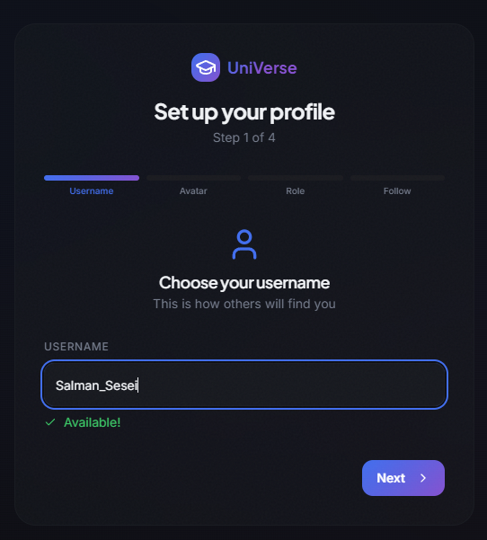
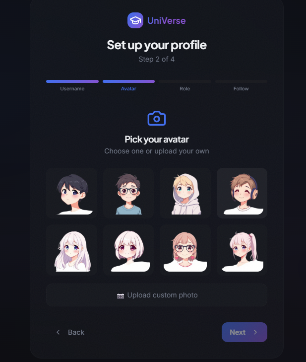
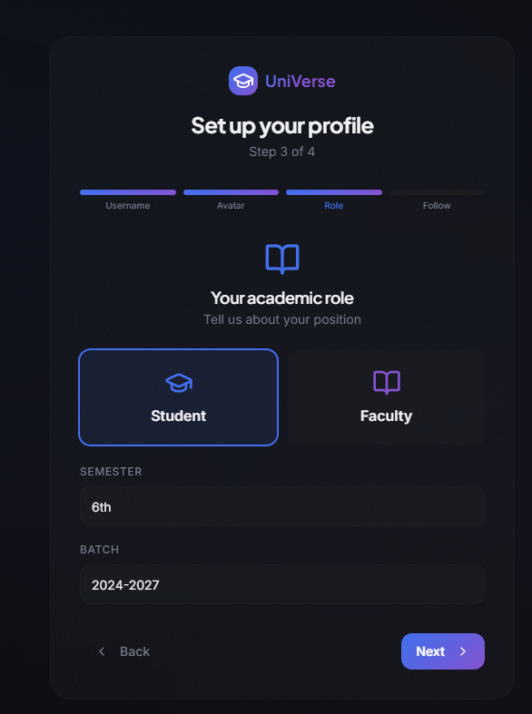
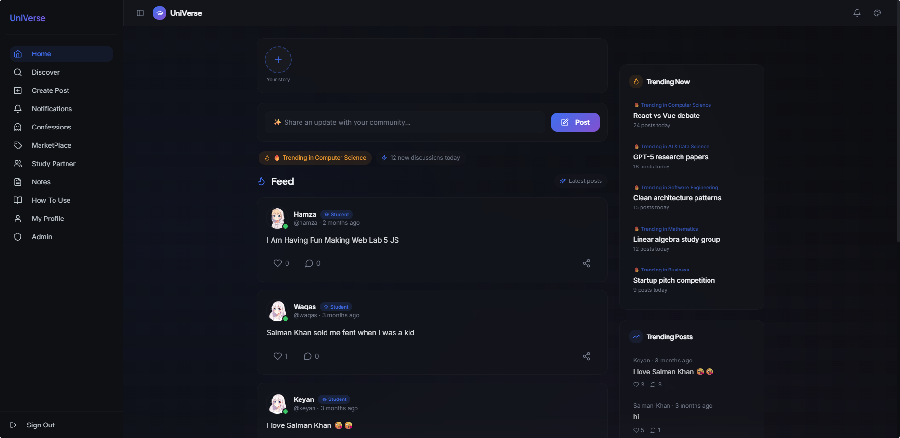
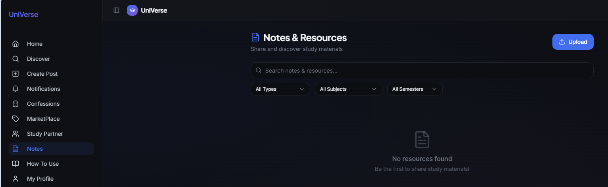
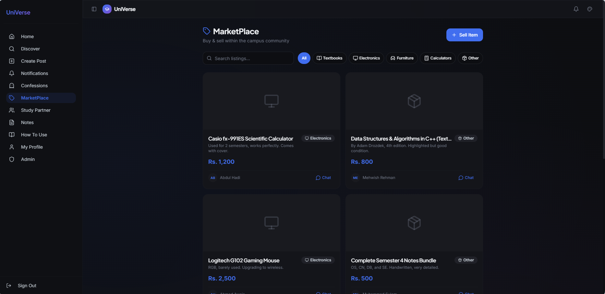
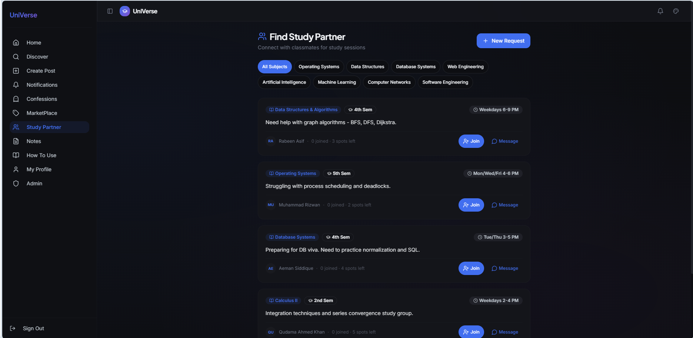
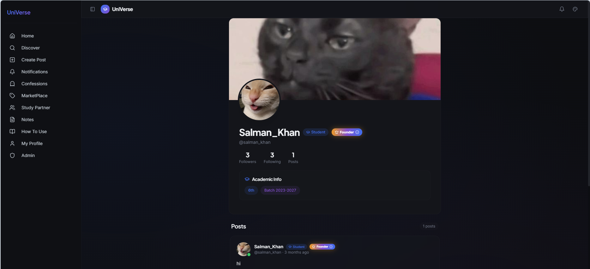

<h1 align="center">UniVerse Campus Platform</h1>

<p align="center">
A campus network for BUKC students and faculty: social feed, messaging, notes, marketplace, and study partners in one place.
</p>

<p align="center">


</p>

---

## Live

| Environment | Link |
|---|---|
| Live app | https://universe-campus-platform.vercel.app/ |
| Repository | https://github.com/Salman-Sensei/universe-campus-platform |

---

## About

UniVerse brings the everyday parts of campus life together so students do not have to juggle group chats, drives, and buy/sell pages. Students share updates, message each other, swap notes, find study partners, and trade books, all inside one verified campus space.

---

## Features (working today)

### Social
| Feature | What it does |
|---|---|
| Home feed | Posts from people you follow plus your own, ordered by smart ranking |
| Stories | 24-hour image or text updates |
| Likes and comments | Instant likes with automatic rollback if saving fails |
| Follow system | Follow students and faculty, see follower counts |
| Discover | Search people, popular users, and trending posts by department |
| Notifications | Real-time alerts for likes, comments, and follows |
| Messaging | One-to-one real-time chat from any profile, Study Partner, or Marketplace listing |

### Academic
| Feature | What it does |
|---|---|
| Notes Hub | Upload and download lecture notes, filtered by subject |
| Study Partner Finder | Create or join study groups by subject |
| AI Assistant | Suggests post ideas and improves drafts |

### Campus
| Feature | What it does |
|---|---|
| Marketplace | Buy and sell books and gadgets, chat with the seller |
| Confession Wall | Anonymous posts, screened by AI before publishing |
| Reputation and badges | Points for activity, role and founder badges |
| Admin dashboard | Role-protected moderation for admins and moderators |
| Onboarding | Username check, avatar, batch, and subject preferences |

---

## AI features

| Feature | How it works |
|---|---|
| AI Assistant | Streaming chat that writes and polishes posts using your interests |
| Confession moderation | Every confession is checked for hate speech, bullying, and explicit content before it goes live |
| Image safety check | Every uploaded image (posts, stories, marketplace, avatars, banners) is checked for nudity and graphic content. Unsafe images are never stored. If the check cannot run, the upload is blocked |
| Smart feed ranking | Scores posts by freshness, likes and comments, whether you follow the author, and match with your interests |

AI runs through server-side functions, so no API keys live in the browser.

---

## Screenshots

### Profile setup
<p align="center"></p>
<p align="center"></p>
<p align="center"></p>

### Home feed
<p align="center"></p>

### Notes Hub
<p align="center"></p>

### Marketplace
<p align="center"></p>

### Study Partner Finder
<p align="center"></p>

### Profile
<p align="center"></p>

---

## Architecture

```text
Browser (React + TypeScript + Vite)
        |
        v
Supabase
  Auth | Postgres with row level security | Storage | Realtime
        |
        v
Edge functions
  ai-assistant | moderate-confession | moderate-image
        |
        v
AI models (via Lovable AI gateway)
```

## Tech stack

- Frontend: React, TypeScript, Vite, Tailwind CSS, shadcn/ui, TanStack Query, Framer Motion
- Backend: Supabase (Postgres, Auth, Storage, Realtime, Edge Functions)
- Deployment: Vercel

---

## Installation

```bash
git clone https://github.com/Salman-Sensei/universe-campus-platform.git
cd universe-campus-platform
npm install
```

Create a `.env` file in the root:

```bash
VITE_SUPABASE_URL=
VITE_SUPABASE_PUBLISHABLE_KEY=
VITE_SUPABASE_PROJECT_ID=
```

```bash
npm run dev
```

Open http://localhost:8080

### Deploying to Vercel
- Root Directory: repository root
- Add the three `VITE_` variables for Production, Preview, and Development
- `vercel.json` already rewrites all routes to `index.html` so deep links work

---

## Future roadmap

- Feed pagination and infinite scroll
- Accurate counts for very large follower and like totals
- Group chats and unread message badges
- AI notes summarizer
- AI people recommendations (batch mates, faculty by subject)
- Video study rooms
- Events and hackathon calendar
- Mobile app
- Multi-university support
- Faculty analytics dashboard

---

## Contributing

1. Fork the repository
2. Create a branch: `git checkout -b feature/your-feature`
3. Commit and push
4. Open a pull request

## License

MIT

## Maintainer

**Salman Khan**
Email: skbkhan31@gmail.com
LinkedIn: https://www.linkedin.com/in/salmankhan-developer/
